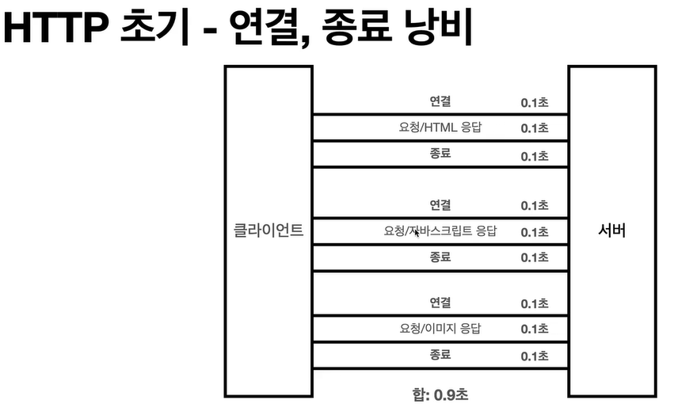
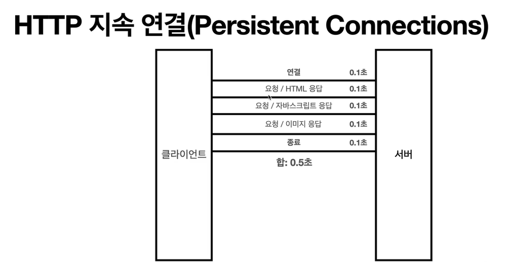
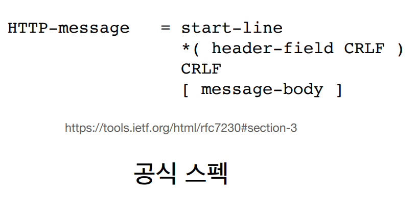

# HTTP 기본

## HTTP(Hyper Text Transfer Protocol)

HTTP 메세지에 모든 것을 전송

- HTML, TEXT
- IMAGE, 음성, 영상, 파일
- JSON, XML(API)
- 거의 모든 형태의 데이터 전송 가능
- 서버간에 데이터를 주고 받을 때도 대부분 HTTP 사용
- HTTP 시대!

### HTTP 역사

- HTTP/0.9 1991년: GET 메서드만 지원, HTTP 헤더 X
- HTTP/1.0 1996년: 메서드 , 헤더 추가
- HTTP/1.1 1997년: 가장 많이 사용, 우리에게 가장 중요한 버전
- HTTP/2.0 2015년: 성능 개선
- HTTP/3.0 : TCP 대신 UDP 사용, 성능 개선

### HTTP 특징

- 클라이언트 서버 구조
- 무상태 프로토콜(스테이스리스), 비연결성
- HTTP 메세지
- 단순함, 확장 가능

## 클라이언트 서버 구조

- Request, Response 구조
- 클라이언트 서버에 요청을 보내고 , 응답을 대기
- 서버가 요청에 대한 결과를 만들어서 응답
    
    
    

## 무상태 프로토콜(Stateless)

- 서버가 클라이언트의 상태를 보존X
- 장점: 서버 확장성 높음
- 단점: 클라이언트가 추가 데이터 전송

### Stateful, Stateless 차이

상태유지 - stateful 예제

```markup
고객: 이노트북 얼마인가요?
점원: 100만원 입니다.(노트북 상태 유지)

고객: 2개 구매하겠습니다.
점원 200만원 입니다. 신용카드, 현금중 어떤 걸로 구매 하시겠어요?
(노트북,2개 상태유지)

고객: 신용카드로 구매하겠습니다.
점원: 200만원 결제 완료되었습니다.(노트북, 2개, 신용카드 상태 유지)
```

상태유지 - stateful : 근데 만약 중간에 점원이 바뀐다면???

```markup
고객: 이노트북 얼마인가요?
점원A: 100만원 입니다.

고객: 2개 구매하겠습니다.
점원B: ? 무엇을 2개 구매하시겠어요?

고객: 신용카드로 구매하겠습니다.
점원C: ? 무슨 제품을 몇개 신용카드로 구매하시겠어요?

```

무상태 - stateless

```markup
고객: 이노트북 얼마인가요?
점원: 100만원 입니다

고객: 노트북 2개 구매하겠습니다.
점원: 200만원 입니다. 신용카드, 현금중 어떤 걸로 구매 하시겠어요?

고객: 노트북 2개를 신용카드로 구매하겠습니다.
점원: 200만원 결제 완료되었습니다.(노트북, 2개, 신용카드 상태 유지)
```

무상태 - stateless , 점원이 중간에 바뀐다면??

```markup
고객: 이노트북 얼마인가요?
점원A: 100만원 입니다

고객: 노트북 2개 구매하겠습니다.
점원B: 200만원 입니다. 신용카드, 현금중 어떤 걸로 구매 하시겠어요?

고객: 노트북 2개를 신용카드로 구매하겠습니다.
점원C: 200만원 결제 완료되었습니다.(노트북, 2개, 신용카드 상태 유지)
```

상태 유지에서 만약 점원이 바뀐다면 이 서비스는 에러가 발생하는 것이다.

하지만 무상태에서는 클라이언트가 그때 그때 필요한 정보를 모두 전달한다.

그래서 중간에 점원이 바뀌어도 아무 문제가 없다.

- 상태 유지: 중간에 다른 점원으로 바뀌면 안된다.
    - 중간에 다른 점원으로 바뀔 때 상태 정보를 다른 점원에게 미리 알려줘야 한다.
- 무상태: 중간에 다른 점원으로 바뀌어도 된다.
    - 갑자기 고객이 증가해도 점원을 대거 투입할 수 있다.
    - 갑자기 클라이언트 요청이 증가해도 서버를 대거 투입할 수 있다.
- 무상태는 응답 서버를 쉽게 바꿀 수 있다.

### Stateless

- 모든 것을 무상태로 설계 할 수 있는 경우도 있고 없는 경우도 있다.
- 무상태
    - 예) 로그인이 필요 없는 단순한 서비스 소개 화면
- 상태 유지
    - 예) 로그인
- 로그인한 사용자의 경우 로그인 했다는 상태를 서버에 유지
- 일반적으로 브라우저 쿠키와 서버 세션등을 사용해서 상태 유지
- 상태 유지는 최소한만 사용

## 비 연결성

- HTTP는 기본이 연결을 유지하지 않는 모델
- 일반적으로 초 단위의 이하의 빠른 속도로 응답
- 1시간 동안 수천명이 서비스를 사용해도 실제 서버에서 동시에 처리하는 요청은 수십개 이하로 매우적음
    - 예) 웹 브라우저에서 계속 연속해서 검색 버튼을 누르지 않는다.
- 서버 자원을 매우 효율적으로 사용할 수 있음

한계 와 극복

- TCP/IP 연결을 새로 맺어야 함 - 3 way handshake 시간 추가
- 웹 브라우저로 사이트를 요청하면 HTML 뿐만 아니라 JS, CSS, 추가 이미지등 수많은 자원이 함께 다운로드
- 지김은 HTTP 지속 연결(Persistent Connection)로 문제 해결
- HTTP/2.0, HTTP/3.0 에서 더 많은 최적화





## 스테이스리스 를 기억하자

서버 개발자들이 어려워하는 업무

- 정말 같은 시간에 딱 맞추어 발생하는 대용량 트래픽
- 예) 선착순 이벤트, 명절 KTX 예약, 학과 수업등록 등
- 예) 저녁 6:00 선착순 1000명 치킨 할인 이벤트(수만명 동시 요청)

## HTTP 메세지

HTTP 요청 메세지

```markup
GET/ search?q=hello&hi=ko HTTP/1.1
HOST: www.google.com
```

HTTP 응답 메세지

```markup
HTTP/1.1 200 OK
Content-Type: text/html;charset=UTF-8
Content-Length:3423

<html>
	<body>.....</body>
</html>
```




## 시작 라인(요청 메세지)

- start-line = request-line / status-line
- request-line = method SP(공백) request-target SP HTTP-version CRLF(엔터)

- HTTP 메서드 (GET: 조회)
- 요청 대상/(/search?q=hello&hi=ko)
- HTTP Version

### HTTP 메서드

- 종류, GET, POST, PUT, DELETE ….
- 서버가 수행해야 할 동작 지정
    - GET : 리소스 조회
    - POST: 요청 내역 처리

### 요청 메세지- 요청 대상

- absolute-path[?query] (절대경로?쿼리)
- 절대경로 = “/” 로 시작하는 경로
- 참고: *, http://…?x=y 와 같이 다른 유형의 경로지정 방법도 있다.

## 시작 라인 (응답 메세지)

- start-line = request-line / status-line
- status-line = HTTP-version SP status-code SP reason-phrase CRLF

- HTTP 버전
- HTTP 상태코드 : 요청 성공, 실패를 나타냄
    - 200 : 성공
    - 400: 클라이언트 요청 오류
    - 500: 서버 내부 오류
- 이유 문구: 사람이 이해할 수 있는 짧은 상태 코드 설명 글

## HTTP 헤더

- header-field = filed-name “:” OWS field-value OWS   (OWS: 띄어쓰기 허용)
- field-name 은 대소문자 구문 없음


### HTTP 헤더 용도

- HTTP 전송에 필요한 모든 부가정보
- 예) 메시지 바디의 내용, 메시지 바디의 크기, 압축, 인증, 클라이언트(브라우저) 정보, 서버 애플리케이션 정보, 캐시 관리 정보 …
- 표준 헤더가 너무 많음
    - [https://en.wikipedia.org/wiki/List_of_HTTP_header_fields](https://en.wikipedia.org/wiki/List_of_HTTP_header_fields)
- 필요시 임시의 헤더 추가 가능
    - 예) helloworld: hihi
    

### HTTP 메세지 바디

- 실제 전송할 데이터
- HTML 문서, 이미지 영상, JSON 등등, byte로 표현할 수 있는 모든 데이터 전송 가능
    
    
    

### HTTP 정리

- HTTP 메세지에 모든 것을 전송
- HTTP 역사 HTTP/1.1을 기준으로 학습
- 클라이언트 서버 구조
- 무상태 프로토콜(스테이스리스)
- HTTP 메세지
- 단순함, 확장 가능