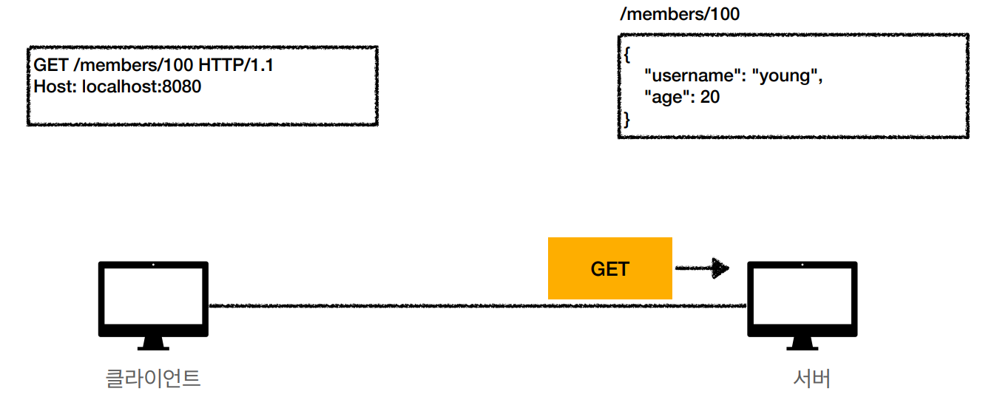
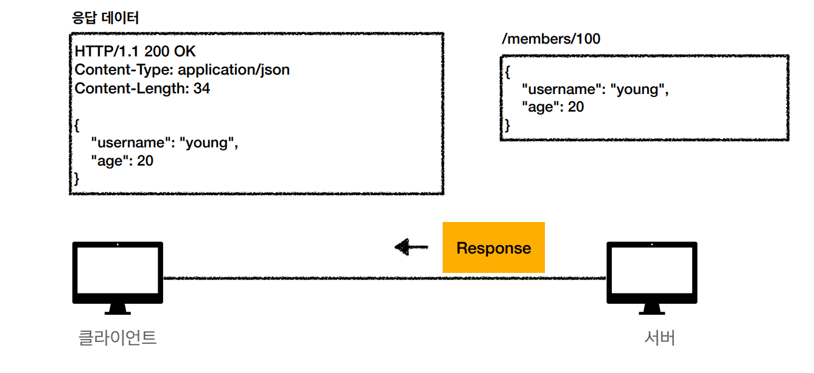
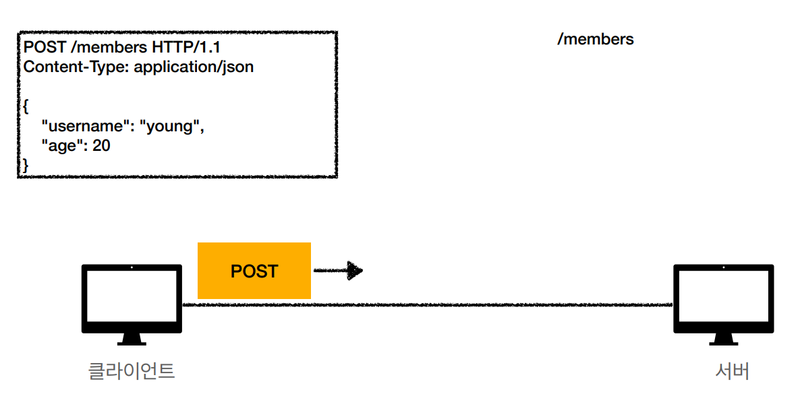
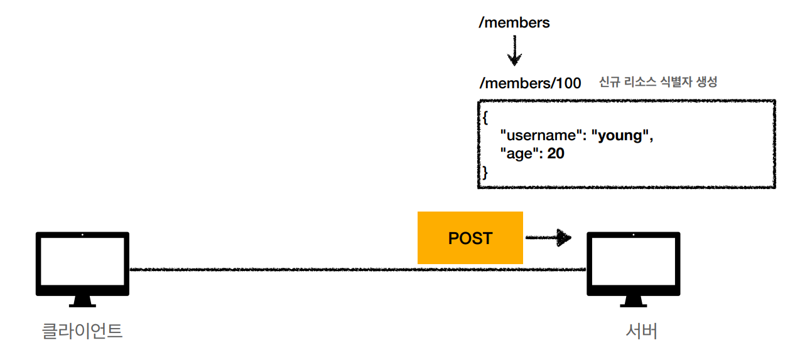
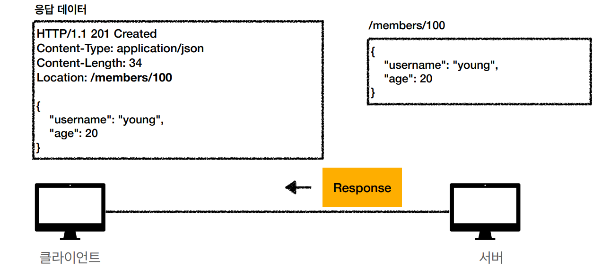
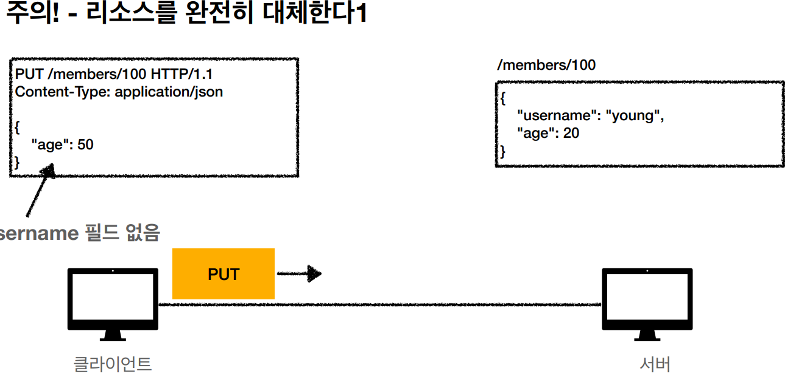
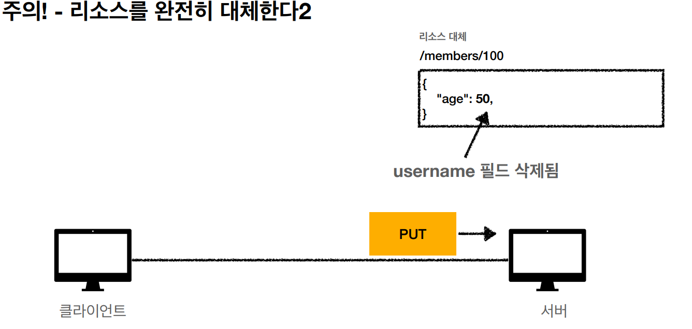
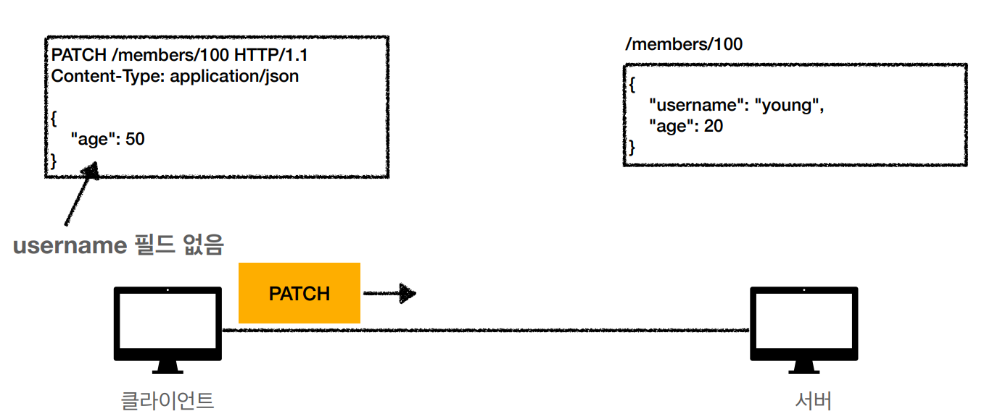
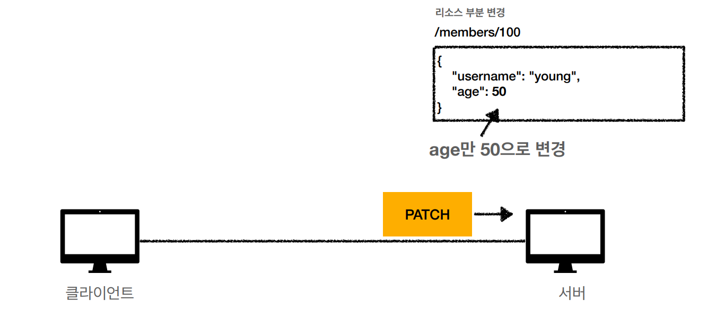
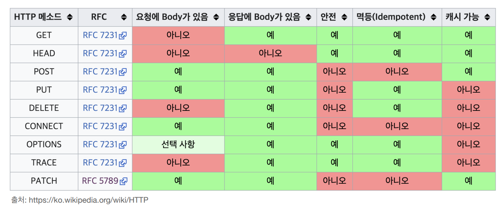

# HTTP 메서드

## API URI 고민

- 리소스의 의미는 뭘까?
    - 회원을 등록하고 수정하고 조회하는게 리소스가 아니다
    - 예) 미네랄을 캐라 → 미네랄이 리소스
    - 예) 미니언 막타를 처라 → 미니언이 리소스
    - 회원 이라는 개념 자체가 바로 리소스다.
- 리소스를 어떻게 식별하는게 좋을까?
    - 회원을 등록하고 수정하고 조회하는 것을 모두 배제
    - 회원이라는 리소스만 식별하면 된다. → 회원 리소스를 URI에 매칭
    
- **회원** 목록 조회 / members
- **회원** 조회 / members/{id} → **어떻게 구분하지?**
- **회원** 등록 / members/{id} → **어떻게 구분하지?**
- **회원** 수정 / members/{id} → **어떻게 구분하지?**
- **회원** 삭제 / members/{id} → **어떻게 구분하지?**

## 리소스와 행위를 분리

### 가장 중요한 것은 리소스를 식별하는 것

- URI는 리소스만 식별!
- 리소스와 해당 리소스를 대상으로 하는 행위를 분리
    - 리소스: 회원
    - 행위: 조회,등록, 수정, 삭제
- 리소스는 명사, 행위는 동사(미네랄을 캐라)
- 행위(메서드)는 어떻게 구분?

## HTTP 메서드 종류

- GET : 리소스 조회
- POST : 요청 데이터 처리, 주로 등록에 사용
- PUT : 리소스를 대체, 해당 리로스가 없으면 생성
- PATCH: 리소스 부분 변경
- DELETE: 리소스 삭제

그외 메서드

- HEAD : GET과 동일하지만 메세지 부분을 제외하고, 상태 줄과 헤더만 반환
- OPTIONS : 대상 리로스에 대한 통신 기능 옵션(메서드)을 설명(주로 CORS에서 사용)
- CONNECT : 대상 자원으로 식별되는 서버에 대한 터널을 설정
- TRACE : 대상 리소스에 대한 경로를 따라 메세지 루프백 테스트를 수행

## GET

- 리소스 조회
- 서버에 전달하고 싶은 데이터는 query(쿼리 파라미터, 쿼리 스트링)를 통해서 전달
- 메시지 바디를 사용해서 데이터를 전달할 수 있지만, 지원하지 않는 곳이 많아서 권장하지 않음





## POST

- 요청 데이터 처리
- 메시지 바디를 통해 서버로 요청 데이터 전달
- 서버는 요청 데이터를 처리
    - 메시지 바디를 통해 들어온 데이터를 처리하는 모든 기능을 수행한다.
- 주로 전달된 데이터로 신규 리소스 등록, 프로세스 처리에 사용







- 스펙: POST 메서드는 대상 리소스가 리소스의 고유 한 의미 체계에 따라 요청에 포함 된 표현을 처리하도록 요청
- 예를 들어 POST는 다음과 같은 기능에 사용
    - HTML 양식에 입력 된 필드와 같은 데이터 블록을 데이터 처리 프로세스에 제공
        - 예) HTML FORM에 입력한 정보로 회원 가입, 주문 등록 등
    - 게시판, 뉴스 그룹, 메일링 리스트, 블로그 또는 유사한 기사 그룹에 메세지 게시
        - 예) 게시판 글쓰기, 댓글 달기
    - 서버가 아직 식별하지 않은 새 리소스 생성
        - 예) 신규 주문 생성, 회원 생성
    - 기존 자원에 데이터 추가
        - 예) 한 문서 끝에 내용 추가하기
- 정리: 이 리소스 URI에 POST 요청이 오면 요청 데이터를 어떻게 처리할지 리소스마다 따라 정해야 함 → 정해진 것이 없음

### 정리

1. 새 리소스 생성(등록)
    1. 서버가 아직 식별하지 않은 새 리소스 생성
2. 요청 데이터 처리
    1. 단순히 데이터를 생성하거나, 변경하는 것을 넘어서 프로세스 처리해야 하는 경우
        1. 예) 주문에서 결제 완료 → 배달 시작 → 배달 완료 처럼 단순히 값 변경을 넘어 프로세스의 상태가 변경되는 경우
    2. POST의 결과로 새로운 리소스가 생성되지 않을 수도 있음
        1. 예) POST / orders/{orderId}/start-delivery (컨트롤 URI)
3. 다른 메서드로 처리하기 애매한 경우
    1. 예) JSON으로 조회 데이터를 넘겨야 하는데, GET 메서드를 사용하기 어려운 경우
    2. 애매하면 POST

## PUT

```markup
PUT/members/100 HTTP/1.1
Content-Type: application/json
{
"username":"hello",
"age":20
}
```

- 리소스를 대체
    - 마치 어떤 파일을 복사하는 것과 유사 없으면 생성되고 있으면 덮어쓴다.
    - 리소스가 있으면 대체
    - 리소스가 없으면 생성
    - 쉽게 이야기해서 덮어버림
- 중요! 클라이언트가 리소스를 식별
    - 클라이언트가 리소스 위치를 알고 URI 지정
    - POST와 차이점
        
        
        
        
        

## PATCH

```markup
PATCH /members/100 HTTP/1.1
Content-Type: application/json
{
"age":50
}
```

- 리소스 부분 변경
    
    
    
    
    

## DELETE

```markup
DELETE /members/100 HTTP/1.1
Host: localhost:8080
```

- 리소스 제거

## HTTP 메서드의 속성

- 안전(Safe Methods)
- 멱등(Idempotent Methods)
- 캐시가능(Cacheable Methods)
    
    
    

## 안전(Safe Methods)

- 호출해도 리소스를 변경하지 않는다
- Q: 그래도 계속 호출해서, 로그 같은게 쌓여서 장애가 발생하면?
- A: 안전은 해당 리소스만 고려한다. 그런 부분까지 고려하지 않는다.

## 멱등(Idempotent Methods)

- f (f(x)) = f(x)
- 한번 호출하든 두번 호출하든 100번 호출하든 결과가 똑같다.
- 멱등 메서드
    - GET : 한번 조회하던, 두번 조회하던 같은 결과가 조회된다.
    - PUT : 결과를 대체한다. 따라서 같은 요청을 여러번 해도 최종 결과는 같다
    - DELETE : 결과를 삭제한다. 같은 요청을 여러번 해도 삭제된 결과는 똑같다.
    - POST:  멱등이 아니다! 두 번 호출하면 같은 결제가 중복해서 발생할 수 있다.
- 활용
    - 자동 복구 메커니즘
    - 서버가 TimeOut 등으로 정상 응답을 못주었을 때, 클라이언트가 같은 요청을 다시 해도 되는가? 판단 근거

## 캐시가능(Cacheable Methods)

- 응답 결과 리소스를 캐시해서 사용해도 되는가?
- GET , HEAD , POST , PATCH 캐시가능
- 실제로는 GET, HEAD 정도만 캐시 사용
    - POST, PATCH는 본문 내용까지 캐시 키로 고려해야 하는데, 구현이 쉽지 않다.