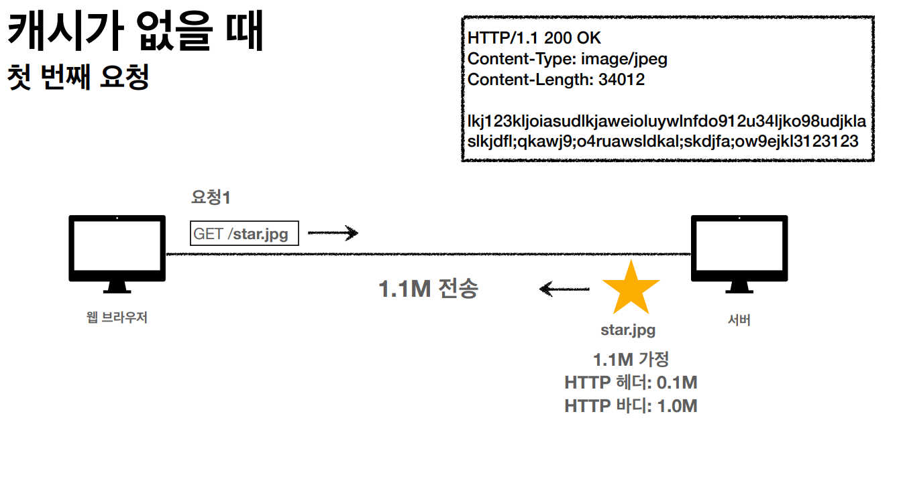
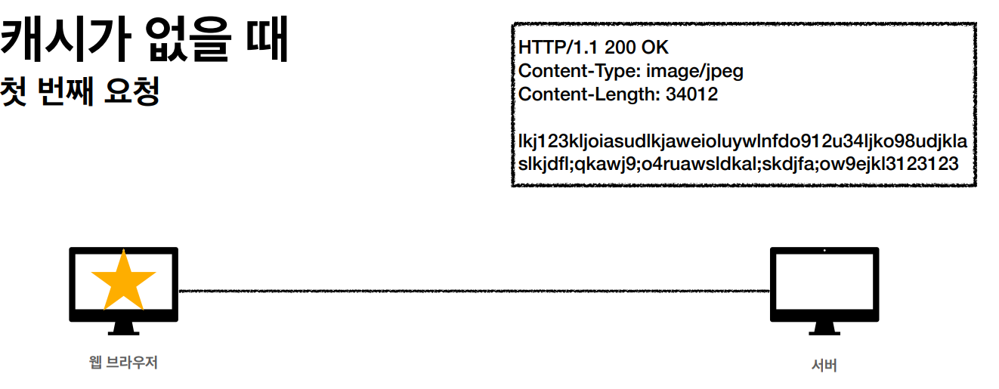
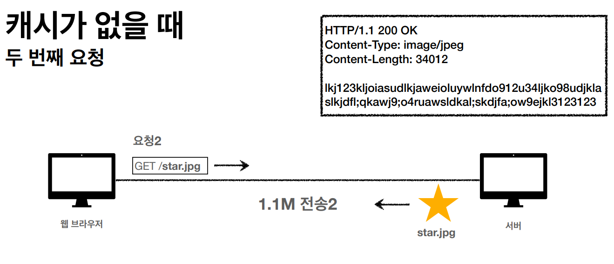
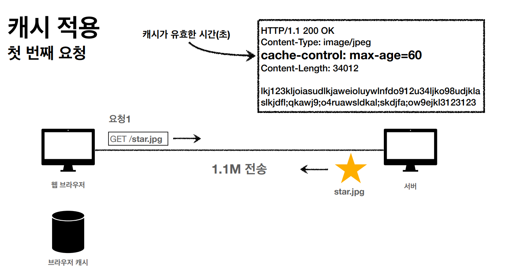
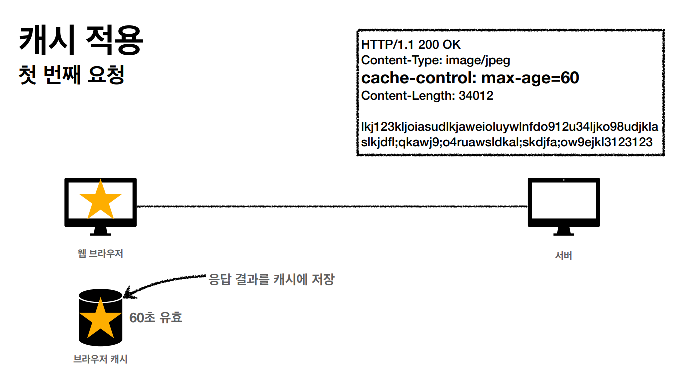
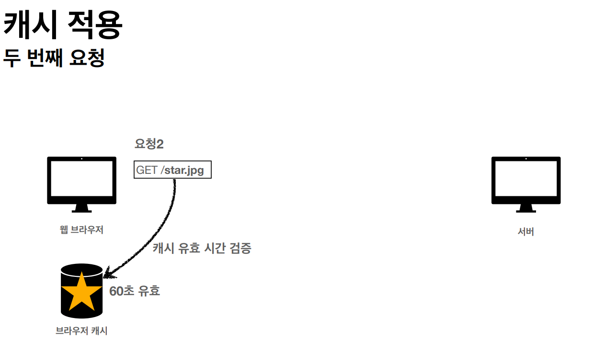
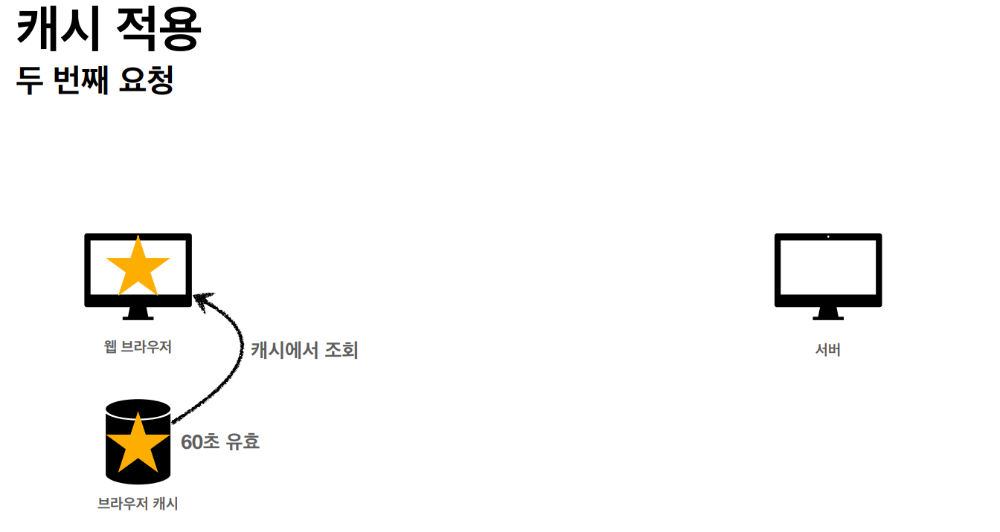
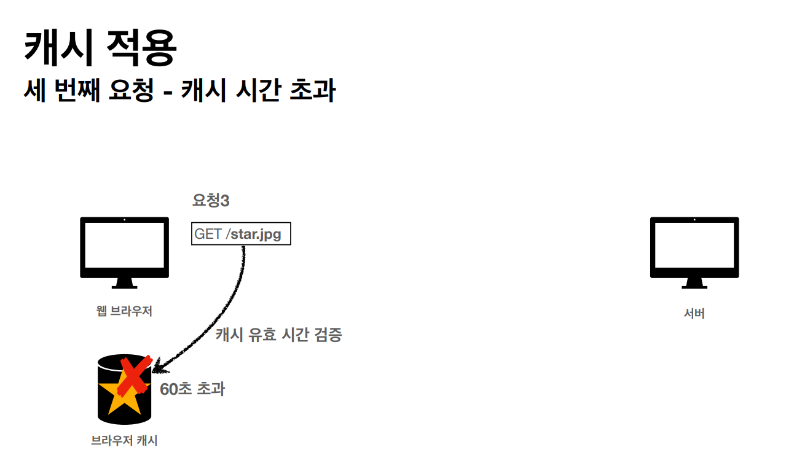
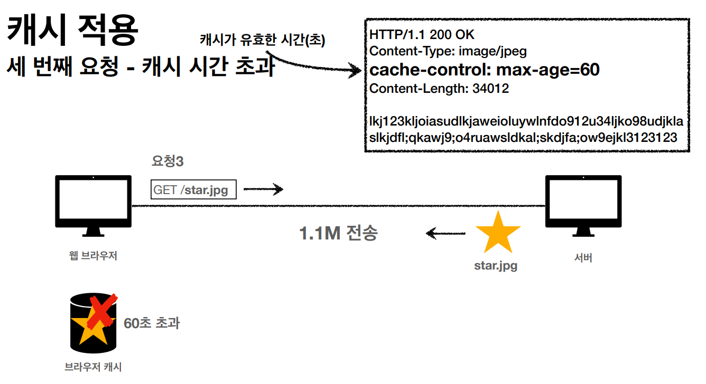
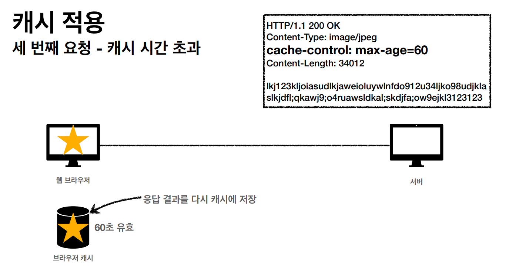

# HTTP 헤더2

### 캐시 기본 동작

## 캐시가 없을 때

- 데이터가 변경되지 않아도 계속 네트워크를 통해서 데이터를 다운로드 받아야 한다.
- 인터넷 네트워크는 매우 느리고 비싸다.
- 브라우저 로딩 속도가 느리다.
- 느린 사용자 경험

## 캐시 적용

- 캐시 덕분에 캐시 가능 시간동안 네트워크를 사용하지 않아도 된다.
- 비싼 네트워크 사용량을 줄일 수 있다.
- 브라우저 로딩 속도가 매우 빠르다.
- 빠른 사용자 경험

## 캐시 시간 초과

- 캐시 유효 시간이 초과하면, 서버를 통해 데이터를 다시 조회하고, 캐시를 갱신한다.
- 이떄 다시 네트워크 다운로드가 발생한다.

- 캐시 유효 시간이 초과해서 서버에 다시 요청하면 다음 두가지 상황이 나타난다.
    1. 서버에서 기존 데이터를 변경함
    2. 서버에서 기존 데이터를 변경하지 않음

- 캐시 만료후에도 서버에서 데이터를 변경하지 않음
- 생각해보면 데이터를 전송하는 대신에 저장해 두었던 캐시를 재사용 할 수 있다.
- 단 클라이언트의 데이터와 서버의 데이터 가 같다는 사실을 확인할 수 있는 방법 필요
    
    
    

## 검증 헤더 추가

## 정리

- 캐시 유효 시간이 초과해도, 서버의 데이터가 갱신되지 않으면
- 304 Not Modified + 헤더 메타 정보만 응답(바디X)
- 클라이언트는 서버가 보낸 응답 헤더 정보로 캐시의 메타 정보를 갱신
- 클라이언트는 캐시에 저장되어 있는 데이터 재활용
- 결과적으로 네트워크 다운로드가 발생하지만 용량이 적은 헤더 정보만 다운로드
- 매우 실용적인 해결책

## 캐시 시간 초과

- 캐시 유효 시간이 초과해서 서버에 다시 요청하면 다음 두 가지 상황이 나타난다.