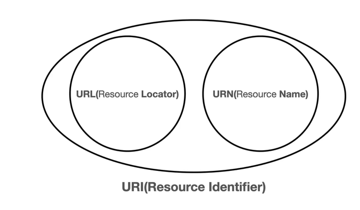
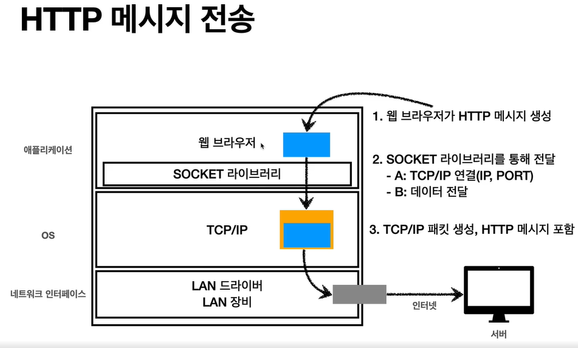
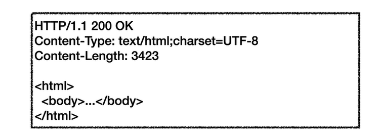

# URI와 웹 브라우저 요청 흐름

## URI(Uniform Resource Identifier)

URI?, URL?, URN?

**URI 는 로케이터(locator), 이름(name) 또는 둘다 추가로 분류될 수 있다.**

URI 라는 가장 큰 개념이 있다(이는 리소스를 식별하는 방법이다).

이때 이를 식별하는 방법은 크게 두가지가 있다.

1. URL(Resource Locator) : 리소스가 해당 위치에 존재한다.
2. URN(Resource Name) : 리소스의 이름



URL(Resource Locator)

```jsx
foo://example.com:8042/over/there?name=ferret#nose
스키마/ authority     /path     / query      / fragment

```

URN(Resource Name) 

```jsx
urn:example:animal:ferret:nose
```

### 단어 뜻

- Uniform : 리소스 식별하는 통일된 방식
- Resource: 자원, URI로 식별할 수 있는 모든 것(제한없음)
- Identifier: 다른 항목과 구분하는데 필요한 정보

- URL : Uniform Resource Locator - 리소스가 있는 위치를 지정
- URN: Uniform Resource Name - 리소스에 이름을 부여
    - URN 이름만으로 실제 리소스를 찾을 수 있는 방법이 보편화 되지 않음

### 전체 문법

- scheme://[userinfo@]host[:port][/path][?query][#fragment]
- [https://www.google.com/search?q=hello&hl=ko](https://www.google.com/search?q=hello&hl=ko)

- 프로토콜(https)
- 호스트명(www.google.com)
- 포트번호(443)
- 패스(/search)
- 쿼리 파라미터([q=hello&hl=ko](https://www.google.com/search?q=hello&hl=ko))

## Scheme

- https
- 주로 프로토콜 사용
- 프로토콜 : 어떤 방식으로 자원에 접근할 것인가 하는 약속 규칙
    - 예) http, https, ftp 등등
- http 는 80 포트, https 는 443 포트를 주로 사용, 포트 생략 가능
- https는 http에 보안 추가( Http Secure)

### [userinfo@]

- 사용자 인증정보를 추가
- 거의 사용하지않음

### Host

- www.google.com
- 호스트명
- 도메인명 또는 IP 주소를 직접 사용가능

### Port

- 포트(Port)
- 접속 포트
- 일반적으로 생략, 생략시 http 는 80 , https 는 443

### Path

- /search
- 리소스 경로(path), 계층적 구조
- 예)
    - /home/file1.jpg
    - /members
    - members/100, items/ipone14

### Query

- ?q=hello&hi=ko
- key=value 형태
- ?로시작, &로 추가 가능 ?keyA=value&keyB=value
- query parameter, query string 등으로 불림, 웹서버에 제공하는 파라미터, 문자 형태

### Fragment

- html 내부 북마크 등에 사용
- 서버에 전송하는 정보 아님

## 웹 브라우저 요청 흐름

1. DNS 서버에 해당 도메인을 조회해서 IP 와 port정보를 얻음
2. HTTP 요청 메세지를 생성

HTTP 요청 메세지

```jsx
GET/search?q=hello&hi=ko HTTP/1.1
HOST: www.google.com
```



1. 패킷을 만들어서 인터넷망에 전송
2. 여러 노드를 거쳐서 구글 서버에 전달
3. 구글 서버에서 HTTP 메세지를 해석 하고 처리
4. HTTP 응답 메세지를 전달
    
    