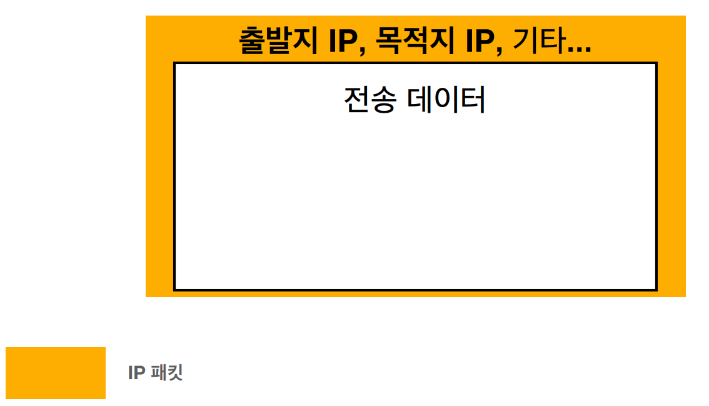
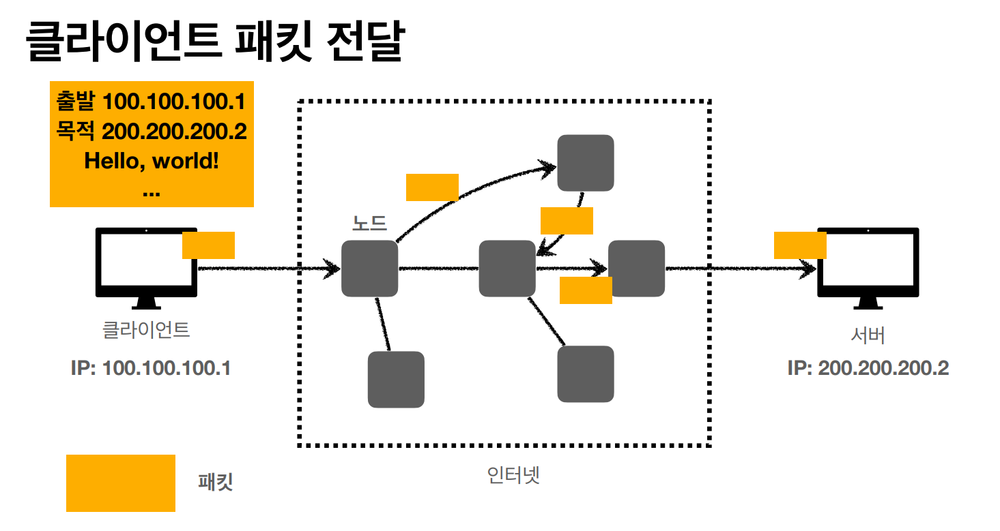
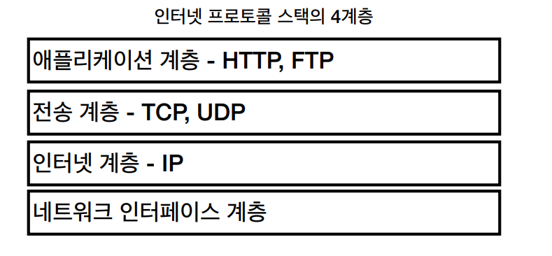
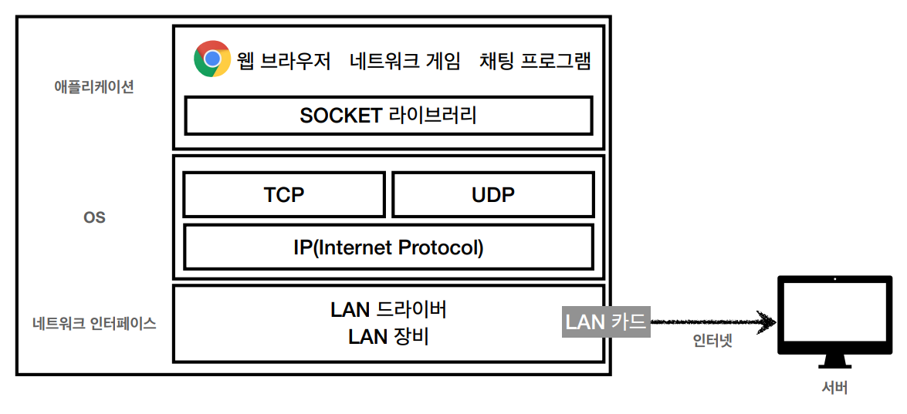
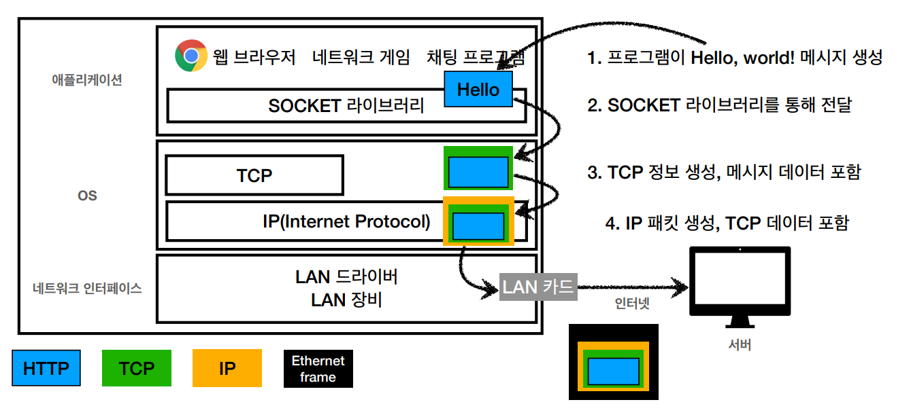
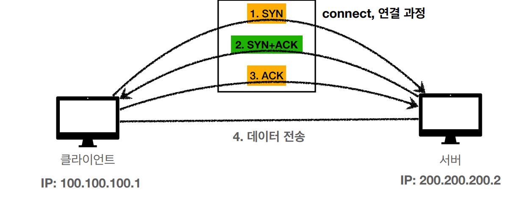
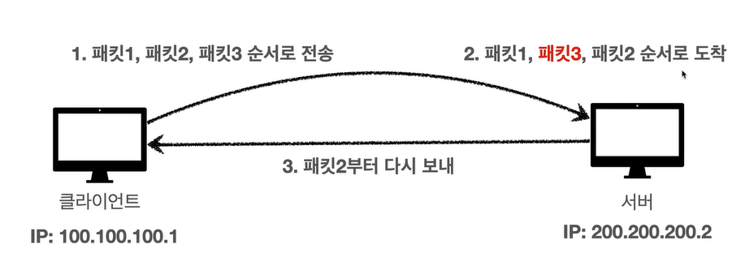
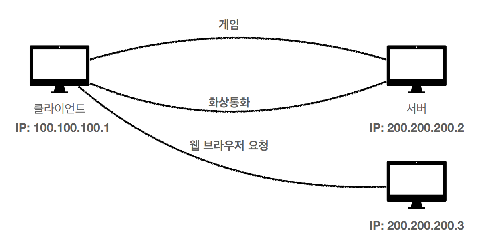
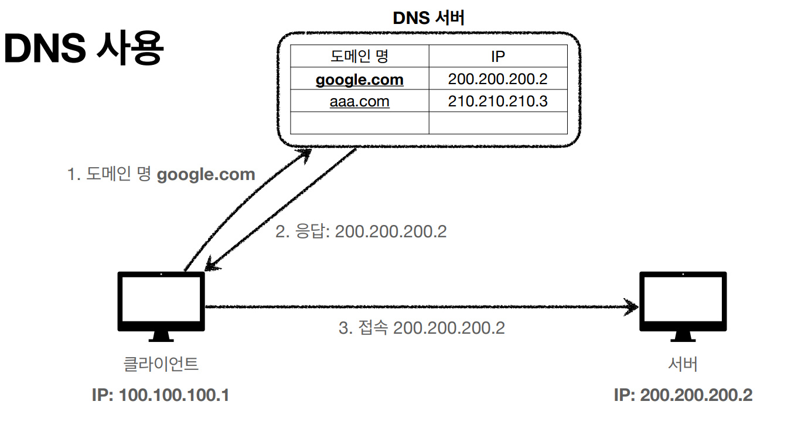

# 인터넷 네트워크

## IP(인터넷 프로토콜)

복잡한 인터넷 망에서 내가 작성한 메세지를 미국사는 친구한테 보낼려면 어떻게 해야될까???
이를 가능하게 하는 것이 `IP` 이다.

즉 IP는 인터넷 프로토콜 역할 을 수행한다.

- 지정한 IP 주소(IP Address)에 데이터 전달
- 패킷(Packet)이라는 통신 단위로 데이터 전달.

### IP 패킷 정보

  
출발지 IP 와 도착지 IP,기타 정보, 전송데이터를 인터넷망에 전달한다.

그러면 각각의 노드들이 패킷을 전달하면서 최종적으로 도착지 IP까지 전달하게 된다.



반대로 서버측에서 클라이언트 측에서 전달한 데이터를 잘 받았다면 똑같이 출발지 IP 와 목적지 IP 그리고 응답 메세지를 클라이언트 측에 전달해 주면 된다.

단, 이때 내가 클라이언트 에서 요청과 서버측 응답이 서로 다른 노드들을 거쳐서 전달 될 수 있다.(즉, 동일한 경로로 전달되지 않을 수도 있다.)

### IP 프로토콜의 한계

- 비연결성
    - 패킷을 받을 대상이 없거나 서비스 불능 상태여도 패킷 전송
- 비신뢰성
    - 중간에 패킷이 사라지면?
    - 패킷이 순서대로 안오면?
- 프로그램 구분
    - 같은 IP를 사용하는 서버에서 통신하는 애플리케이션이 둘 이상이면?
    
    ## TCP
    
    인터넷 프로토콜 스택의 4계층
    
    
    





1. IP 패킷
    1. 출발지 IP
    2.  목적지 IP
    3.  기타..
2. TCP 세그먼트
    1. 출발지 port
    2. 도착지 port
    3. 전송 제어
    4. 순서
    5. 검증 정보…
3. 전송 데이터

### TCP 특징

전송 제어 프로토콜(Transmission Control Protocl)

- 연결 지향 - TCP 3way handshake(가상연결) : 서로 연결 되었는지 확인후 데이터 전달
- 데이터 전달 보증
- 순서 보장

- 신뢰할 수 있는 프로토콜
- 현재는 대부분 TCP 사용

### TCP 3 way handshake



- SYN : 접속 요청
- ACK : 요청 수락
- 3번째 ACK와 함계 데이터 전송 가능

### 데이터 전달 보증

TCP IP 에서는 TCP 에서 서로 연결 되었다면 데이터를 전송하는데 

이때 서버측에서 데이터를 받았으면 `데이터를 잘 받았다는 응답`을 클라이언트 쪽으로 전달해준다.

### 순서 보장

만약 클라이언트 쪽에서 패킷1,패킷2, 패킷3 순서대로 서버측에 전달을 했을때

서버측에서 패킷1,패킷3,패킷2 순서로 도착을 했다면 클라이언트 쪽으로 다시 패킷2부터 보내달라고 전달을한다.



왜 이런 것이 가능한 것인가??

바로 TCP 세그먼트 안에는 전송제어 , 순서 정보등을 가지고 있기 때문에 가능한 것이다.

## UDP

사용자 데이터그램 프로토콜(User Datagram Protocol)

- 하얀 도화지에 비유(기능이 거의 없음)
- 연결 지향 X
- 데이터 전달 보증 X
- 순서 보장 X
- 데이터 전달 및 순서가 보장되지 않지만, 단순하고 빠름
- 정리
    - IP패킷과 거의 같다. + PORT + 체크섬 정도만 추가
    - 애플리케이션에서 추가 작업이 필요
    
    ## PORT
    
    한번에 둘 이상 연결해야 하면???
    
    지금 현재 클라이언트 PC는 한번에 여러 서버에 접속해야한다.
    
    이때 클라이언트측 으로 패킷이 전달될때 그 패킷이 게임 패킷인지, 화상통화 패킷인지, 웹브라우저 패킷인지 어떻게 구분할 수 있을까??(IP 만으로는 이를 구분할 수 없다.)
    
    
    
    즉, IP는 목적지 서버를 찾는 것,
    
    PORT 는 같은 IP 내에서 프로세스를 구분할때 사용한다.
    
    ```jsx
    게임 port : 1120
    200.200.200.2 IP에 1120 port에 패킷을 전달
    화상통화 port: 32202
    200.200.200.2 IP에 32202 port에 패킷을 전달
    웹브라우저 port: 80
    200.200.200.3 IP에 80 port에 패킷을 전달
    ```
    
    좀더 쉽게 이해하자면 IP 는 아파트고 Port는 몇동 몇호
    
- 0~65535 할당 가능
- 0~1023: 잘 알려진 포트, 사용하지 않는 것이 좋음
- FTP - 20 ,21
- TELNET - 23
- HTTP - 80
- HTTPS -443

## DNS(Domain Name System)

IP의 문제점

1. IP 는 기억하기 어렵다.
2. IP는 변경될 수 있다.

DNS(Domain Name System)

- 전화번호부 같은 서버를 제공
- 도메인 명을 IP 주소로 변환
    
    